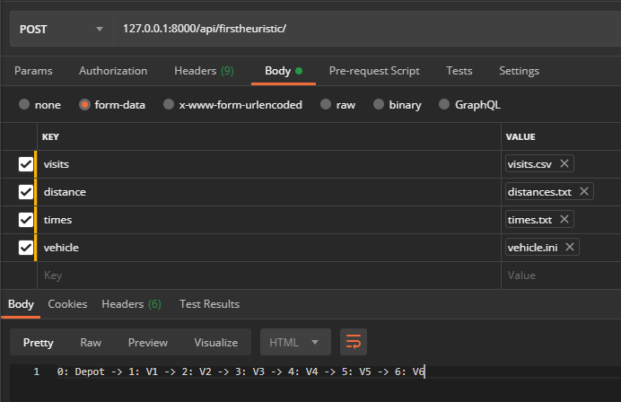

# DeliveryElectricVehicles

## Installation
```bash
git clone https://github.com/Bizkot/DeliveryElectricVehicles.git
cd DeliveryElectricVehicles
python3 -m venv venv
. ./venv/bin/activate
pip install -r requirements.txt
python manage.py runserver
```
Test the server by pinging [localhost](127.0.0.1:8000/api)

## Testing a heuristic
To test a heuristic you need to use an API request builder such as Postman.

You need 5 elements to perform a test:
* The route/URL to the heuristic
* A visit file
* A distance file
* A time file
* A vehicle configuration file


The important point here is that you must have the same "Key" as on the image:
* visits for the visit file
* distance for the distance file
* times for the time file
* vehicle for the vehicle configuration file

## Heuristic list
* api/firstheuristic
* api/secondheuristic